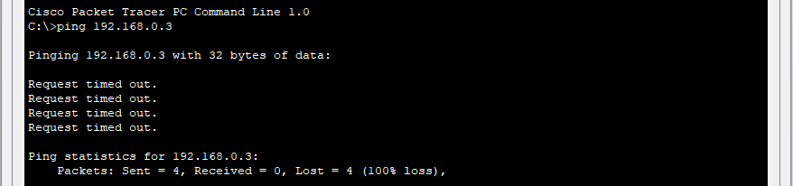
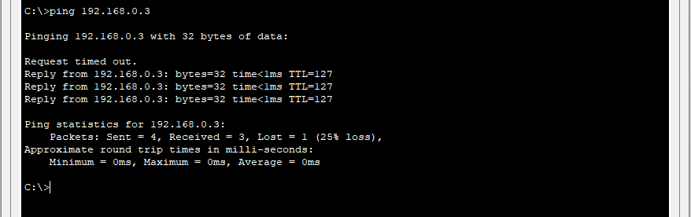

Link Github: [https://github.com/erlinsari/TA2_PraktikumJaringanKomputer.git](https://github.com/erlinsari/TA2_PraktikumJaringanKomputer.git)

Link YouTube: [https://youtu.be/DFgWVjIj1rc?si=hMyhb7lbmaDKJ8tt](https://youtu.be/DFgWVjIj1rc?si=hMyhb7lbmaDKJ8tt)

Tes Ping dari PC-A ke PC-B (Gagal)
PC> ping 192.168.0.3

Ping gagal. Ping dari PC-A (192.168.1.3) menuju PC-B (192.168.0.3) tidak berhasil karena router R1, yang berfungsi sebagai penghubung antar subnet (default gateway), belum dikonfigurasi.
Dalam jaringan ini, PC-A dan PC-B berada pada dua subnet berbeda, yaitu:
PC-A : Subnet 192.168.1.0/24
PC-B : Subnet 192.168.0.0/24
Kedua subnet ini tidak bisa saling berkomunikasi secara langsung karena switch hanya bekerja di Layer 2 (Data Link Layer) yang tidak mampu melakukan routing antar jaringan.
Untuk dapat mengirim data antar subnet, dibutuhkan perangkat Layer 3 yaitu router, yang berfungsi meneruskan (route) paket IP antar jaringan.

Namun karena interface router (GigabitEthernet0/0/0 dan GigabitEthernet0/0/1) belum diberikan alamat IP dan belum diaktifkan (no shutdown), maka router tidak tahu jalur antar jaringan tersebut. Akibatnya, saat PC-A mengirimkan paket ICMP (ping), paket berhenti di switch dan tidak dapat diteruskan ke subnet tujuan.

Tes Ping dari PC-A ke PC-B setelah Router dikonfigurasi (Berhasil)
PC> ping 192.168.0.3

Ping berhasil. Router sekarang sudah melakukan routing terhadap traffic ping melewati kedua subnet. Default settings pada switch 2960 akan secara otomatis mengaktifkan interface yang terhubung ke perangkat. 
Alasan ping berhasil:
- Router interfaces sudah dikonfigurasi dengan IP address yang benar
- Router sudah aktif dan bisa melakukan routing antar subnet
- Switch secara otomatis sudah mengaktifkan port yang terkoneksi.
- Kedua interface router (GigabitEthernet0/0/0 dan GigabitEthernet0/0/1) telah diaktifkan dengan perintah no shutdown sehingga statusnya up/up.
- Router sudah mengenali kedua jaringan sebagai directly connected networks, sehingga dapat meneruskan paket ICMP antar subnet.

Tes Ping dari Switch S1 ke PC-B (Berhasil)
S1# ping 192.168.0.3

Hasil ping dari switch menunjukkan “Success rate is 60 percent (3/5)”, artinya dari lima kali percobaan pengiriman paket ICMP, tiga berhasil dan dua mengalami timeout.

